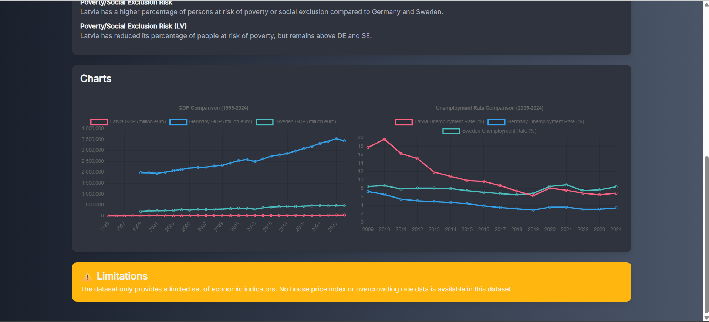

# 🏡 Eurostat Data Analysis – Vue3

A Vue3 frontend that takes in user queries sends them to the backend, displays the results and visualizes the data.

<div align="center">
  
  <br><br>
  
  <br><br>
  
</div>

## 🔍 Overview

This frontend application provides a clean interface for users to input natural language queries about European statistics. The app sends these queries to the backend service, which processes them using AI and Eurostat data, then displays comprehensive analysis results with interactive data visualizations.

## Table of Contents

- [Overview](#-overview)
- [Process Flow](#-process-flow)
- [Quick Start](#-quick-start)
- [Technologies](#️-technologies)
- [CI/CD Pipeline](#-cicd-pipeline)
- [Possible Improvements](#-possible-improvements)
- [Related Projects](#-related-projects)

## 🔄 Process Flow

1. **Query input**: User inputs a query to analyze European statistical data through a simple text interface
2. **Backend**: Query is sent to the backend API which processes it through LLM analysis and fetches relevant Eurostat datasets
3. **Charts**: Retrieved data is visualized using interactive Chart.js components displaying trends, comparisons, and statistical insights
4. **Analysis**: AI-generated analysis with key findings, limitations, and insights is displayed alongside the visualizations

---

## 🚀 Quick Start


### Prerequisites
- Node.js 20+ 
- npm or yarn

### Installation
```bash
git clone <repository-url>
npm install
```

### Environment Variables
```bash
VITE_BACKEND_URL = http://localhost:3000/api
```

### Run Locally
```bash
npm run dev
```

---

## 🛠️ Technologies

- **Vue3** – Progressive JavaScript framework for building user interfaces
- **Vite** – Fast build tool and development server for modern web projects
- **Chart.js** - Flexible JavaScript charting library for data visualization

---

## 🔄 CI/CD Pipeline

### Deployment Process (AWS)
1. **Code Push** → GitHub repository
2. **Build** → Docker image creation
3. **Push** → ECR repository update
4. **Deploy** → ECS service force-new-deployment

---

## ✅ Possible Improvements

- Responsive, professional design. The current design is minimalistic and basic.
- Tables get created by data manually, not using LLM. Thus all datasets can have tables.

---

## 🔗 Related Projects
- [Eurostat Data Analysis - backend](https://github.com/kruminskr/dataAnalyzer-sys)